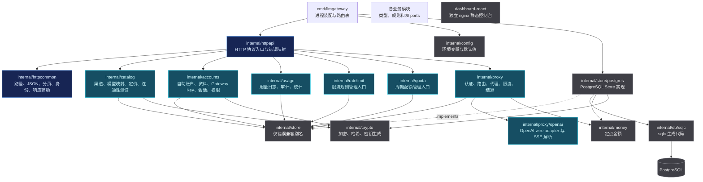
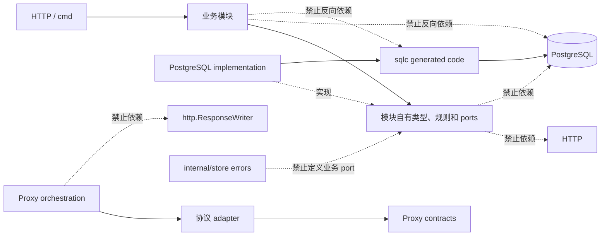
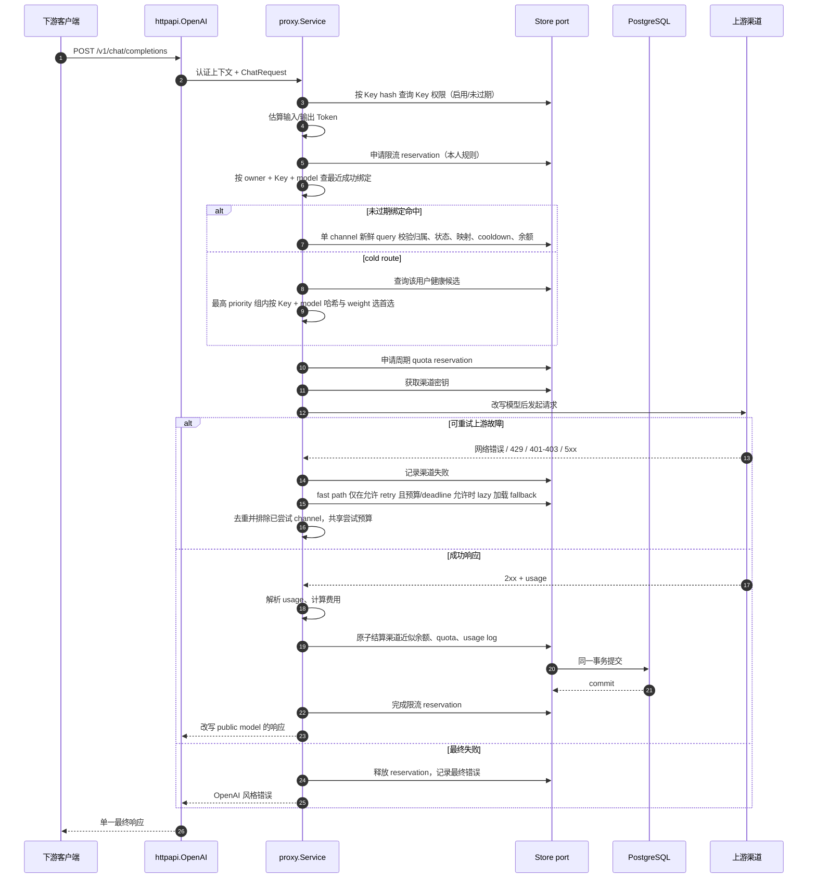
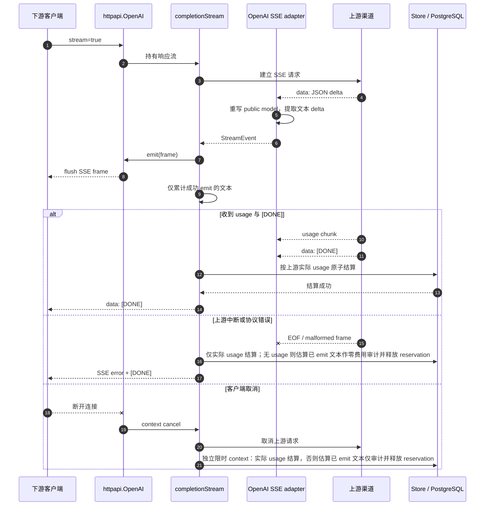
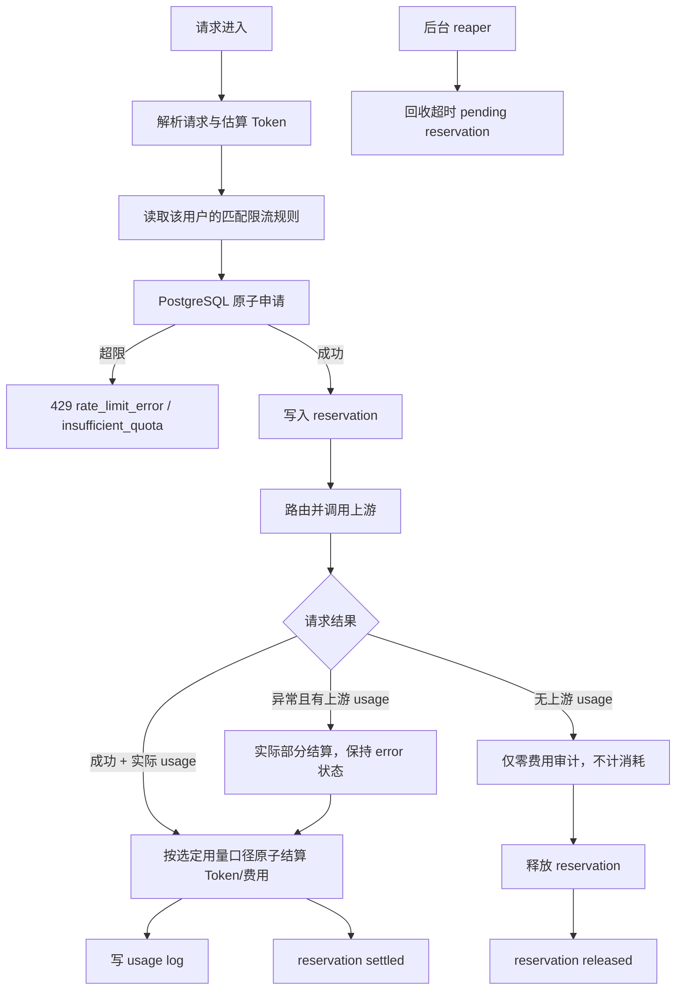
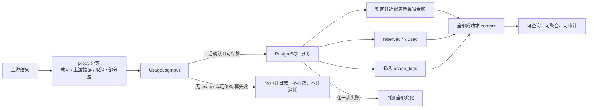

# 模块划分与数据流

本文描述 LLMGateway 的业务模块边界、依赖方向和主要请求数据流。模块划分按业务能力组织，不按 `handler`、`service`、`utils` 等技术层横向堆叠。

## 一、模块总览

### 1. 顶层装配与 HTTP 入口

- `cmd/llmgateway` 负责进程启动、优雅关闭、数据库初始化和顶层路由表。
- `internal/httpapi` 负责 HTTP 方法校验、请求体读取、统一错误映射、会话中间件和业务模块委托；Dashboard 由独立 nginx 服务托管。
- `internal/httpcommon` 只提供跨模块的 HTTP 辅助能力（含 `Identity` 身份传递），不承载渠道、配额、路由或限流规则。
- 路径到入口的映射集中在 `cmd/llmgateway/router.go`，避免业务模块各自注册顶层路由。

### 2. 业务模块

#### `catalog`

拥有渠道、模型映射、定价、定价成本公式和渠道连通性测试。渠道按 `owner_user_id` 隔离；下游请求的选路、重试和结算不在这里。上游失败分类（`ClassifyUpstreamResult`）与定价成本公式（`ComputeCost`/`EstimateReservationCost`）也归本模块，proxy 只调用。

#### `accounts`

拥有自助账户（注册/登录/登出/会话）、资料（昵称/改密码）、Gateway Key 及其归属、认证上下文。Gateway Key 只保存哈希；渠道 API Key 的加密由 `crypto` 提供。不含平台计费、用户状态或分组。

#### `usage`

拥有 usage log、审计查询和统计接口，全部按会话用户过滤。成功请求的日志由 proxy 通过 Store 结算端口写入。

#### `ratelimit`

拥有用户私有限流规则管理入口与纯规则判定：目标匹配、Key override、指标窗口和滑窗计数。proxy 负责加载规则、查询 usage 计数并预留 reservation；持久化端口属于 `store`。

#### `quota`

拥有 UTC 日/月周期配额管理入口，策略只作用于本人 Key；周期配额和短窗口限流使用不同的持久化模型。

#### `proxy`

拥有下游请求的业务编排：Key 认证、模型权限、按 owner 选路、渠道健康、故障切换、限流、配额预留、上游请求和结算。它是跨领域协调者，依赖 `catalog` 的失败分类与定价公式、`ratelimit` 的规则判定，但不直接依赖 PostgreSQL、pgx 或 HTTP `ResponseWriter`，也不向用户计费。

#### `proxy/openai`

只负责 OpenAI 兼容协议边界：请求解析、请求改写、响应改写、SSE 解析、usage 提取和本地 Token 估算，通过 `proxy.ProtocolAdapter` 向协议中立的 proxy 提供能力。`EstimatedUsage.InputTokens` 用于保守准入预留：取完整 JSON 的 tokenizer estimate + 16 与请求字节数 + 16 的较大值；`PromptTokens` 保留前者，不采用字节上界，用于无 usage 的零费用审计。两者均加每个 image_url/input_audio 标记 8192 的媒体预算，未知模型回退 `cl100k_base`。输出按 `max_completion_tokens > max_tokens > QUOTA_DEFAULT_MAX_TOKENS` 并乘 `n` 预留，准入使用 `InputTokens + OutputTokens`。

### 3. 共享领域与基础设施

- 各业务模块拥有自己的协议中立类型、纯规则和窄持久化 port；`domain` 已删除。
- `internal/store` 不定义业务 port；仅保留错误兼容别名。进程装配在 `httpapi`/`proxy`/cmd 边界组合模块 port。
- `store/postgres` 是生产 Store 唯一实现，负责事务、锁、SQL 错误映射和敏感数据存取。
- `db/sqlc` 是生成代码，源头是 `db/queries` 和迁移文件，禁止手改生成文件。
- `money` 是定点金额叶子包，`crypto` 是加密/哈希/密钥生成叶子包；禁止通过日志、响应或错误泄露密钥。

## 二、依赖方向

依赖方向的核心原则是：业务模块表达业务意图，Store 实现持久化细节，HTTP 层表达外部协议，协议 adapter 处理 wire 细节。任何一层越过边界直接操作另一层，都会增加测试、替换实现和后续扩容的成本。

## 三、非流式请求数据流

最近成功 fast path 由 proxy 的进程本地 LRU 持有，按 `owner_user_id + APIKeyID + public model` 隔离，容量 4096，仅缓存 channel ID、generation 和 expires，不缓存密钥；多实例各自缓存。命中后单 channel 新鲜 query 立即校验禁用、模型映射、cooldown 和余额，half-open 仍须获取 probe lease。cold route 保持最高 priority 组内的 Key + model 稳定哈希与 weight 选择。

绑定只在成功结算后写入；流式还必须同时收到 usage 与 `[DONE]` 且正常成功结算，部分结算不 bind。重选周期固定 5 分钟：同 channel 且未过期时保留 expires，generation 仍更新以防 late failure 清除新 success；换 channel、过期或新 binding 从当前时间起算 TTL。候选集合及 priority/weight 变更、高 priority 渠道恢复最多等待剩余周期，不保证立即应用；禁用、映射、cooldown 和余额逐请求立即校验。fast path 仅在允许 retry 且总 deadline、尝试预算允许时 lazy 加载 fallback，去重并排除已尝试渠道，不重置预算。

### 请求中的状态所有权

一次请求中有三类状态：

1. **请求级状态**：request ID、context、候选顺序和最终候选，由 proxy 持有。
2. **临时资源占用**：限流和 quota reservation，由 Store 持久化并以状态机完成或释放。
3. **最终事实**：渠道近似余额变化、usage log 和实际 quota 使用量，在 PostgreSQL 事务中提交。

故障切换只改变候选和渠道健康，不创建新的 request ID，也不创建第二次最终写入。请求总 timeout（`UPSTREAM_REQUEST_TIMEOUT`）默认 600 秒，所有候选尝试和流式读取共享 deadline；quota TTL 默认 660 秒且至少为 timeout + 60 秒，过小配置由配置层和 proxy 提升。普通与 TLS 示例 nginx 的 `/v1` 均关闭响应缓冲，并设读写等待时限为 600 秒（`proxy_read_timeout` / `proxy_send_timeout`）；这些不是请求总 deadline。

## 四、流式 SSE 数据流

当前实现从流式上游返回 2xx 起就不再切换渠道。这样做牺牲了中途续接能力，但避免重复内容、重复生成和无法解释的用量。

正常成功要求 usage 与 `[DONE]` 都收到；异常结束（含缺 DONE、超时、协议错误或客户端断开）只要已有 usage 就优先按实际用量结算，使用 `partial_actual_*`，不要求确认写出文本。只有没有 usage 时，才用合理的 `PromptTokens` estimate 加确认成功 emit 的文本 Token 记录零费用审计，使用 `partial_estimated_*`，不结算并释放 quota 与限流 reservation；没有已写出文本或 tokenizer 失败时不扣费。正常解析到 DONE 但缺 usage 报 `upstream_usage_missing`，不补估算。实际部分结算与本地估算审计都保持 `status=error`，定价/结算使用独立且有限时的 context。

`pricing_error` / `settlement_failed`（含两种 partial 前缀）的日志仅审计，不进入消耗；事务失败回滚 quota、渠道余额与结算日志。日志可保留 usage 证据，但不能据此视为已结算；历史错误日志不自动修复或补记账。

## 五、限流与配额数据流

周期 quota 仍以保守 `InputTokens + OutputTokens` 预留；只有上游确认 usage 才转为 used，没有 usage 则释放预留，本地审计估算不入账。释放的是 reservation，不存在“释放 usage”，usage log 是审计事实。周期 quota 在请求开始阶段预留时选择当时启用的 policy 和 UTC bucket，reservation 保存桶归属，结算不按完成时间换桶。没有匹配启用策略时不创建配额占用，不追溯补记。

限流 reservation、周期 quota reservation 和已结算的 quota 状态不能用进程内变量表达。进程内变量只能用于缓存或性能优化，不能作为多实例环境的最终计数。限流规则按 owner 加载，`target_type` 不含 `global`。

## 六、用量数据流

`usage_logs.request_id` 的唯一约束和 reservation 状态共同防止重复结算。管理端统计从 usage_logs 聚合且按会话用户过滤：`actual_tokens` 为 success 与已结算 `partial_actual_*` 的实际 usage，`total_tokens = actual_tokens`；`estimated_tokens` 独立汇总所有 error 状态的 `partial_estimated_*` 审计估算，包括诊断后缀，始终未结算，不计 total、cost、quota used、限流 Token 消耗或渠道余额扣减。daily 的 input/output/cached 与各统计的 cost 采用同一已结算集合，排除定价/结算失败审计日志；请求数与成功/错误数仍按日志状态计数。

stats 按完成时写入的 `created_at` 归属时间，overview/channels 为 `[start_time,end_time)` 半开范围，daily 按 UTC 自然日分组；quota 按开始时预留桶与当时启用的 policy 归属。跨日/月、策略创建/删除或未启用策略及历史错误日志等情况下，两者不保证绝对相等。历史记录不会自动修复，本次调整不创建迁移或补数据。未来增加 rollup 时，rollup 只是读模型，不能替代 usage_logs 事实表。用户侧没有余额或余额流水。

## 七、扩展时的边界

### 可以独立扩容的部分

- `proxy` 多实例：只要共享 PostgreSQL，路由和配额可以横向扩展。
- Dashboard/管理端：前端由 nginx 独立部署，通过同源反向代理访问 Go 网关的 `/admin`、`/v1` 和 `/healthz`。
- 统计读路径：可以增加异步 rollup 或只读数据库连接。
- 短窗口限流：高吞吐时可以迁移到 Redis/Lua，但必须定义数据库与 Redis 的一致性边界。

### 不应直接拆开的部分

- 渠道近似余额、quota 结算和成功 usage log：必须保持同一事务语义。
- 流式输出和结算：流式完成的判定依赖 `[DONE]`、usage 和客户端写入状态，不能简单丢到异步队列后“最终再记录”。
- 渠道健康状态与路由筛选：健康状态可以由 Store 管理，但路由必须在尝试前读取有效状态。

### 诊断问题的顺序

当请求失败时，先按以下顺序定位：

1. 客户端是否取消或请求 context 是否超时。
2. Key 是否有效，是否被配额或限流拒绝。
3. 是否没有健康候选或渠道余额阈值排除了全部渠道。
4. 上游是否返回可重试故障，故障切换是否用尽。
5. 上游是否已写出流，是否进入部分结算。
6. 最终结算事务是否提交，reservation 是否 settled/released/expired。

这个顺序将“请求没有发出去”“上游失败”“已经产生部分交付”和“结算没有提交”区分开，避免把所有错误都归结为上游不可用。
